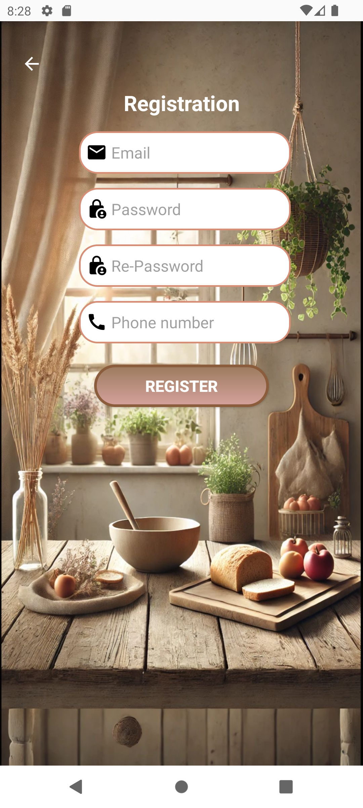
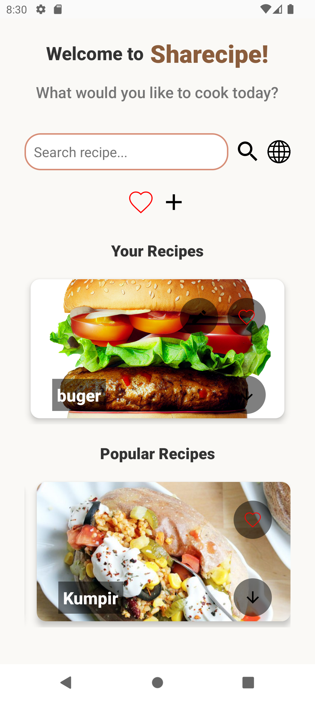
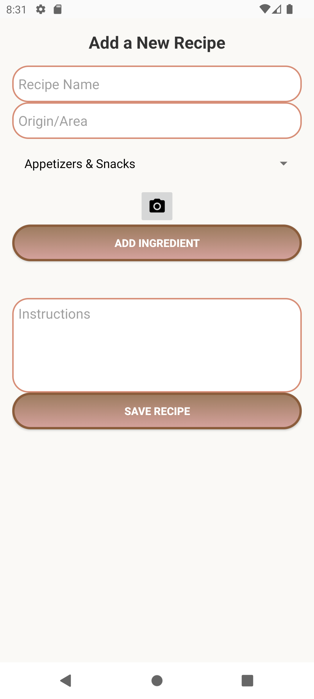
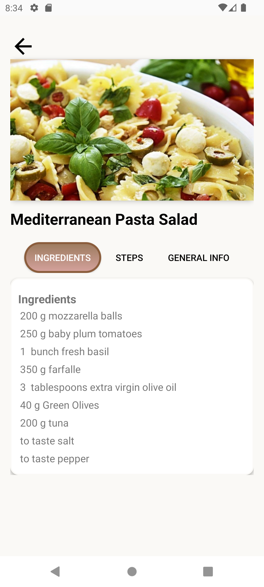
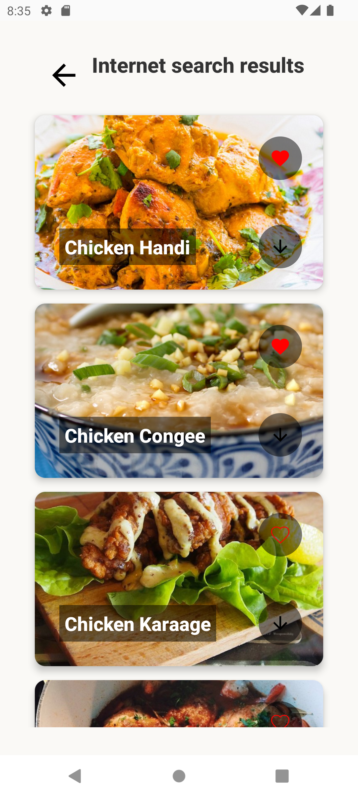

# Sharecipe - Your Go-To Recipe App!

## Overview
 

**Love cooking? Looking for new recipes or want to share your own creations?** **Sharecipe** is here to make your culinary journey easier and more fun! Whether you're craving a fresh salad, a hearty main course, a refreshing drink, or a sweet treat, Sharecipe has something for you. Find inspiration, search for recipes, and upload your own—all in one place!

## Features
- **Smart Search:** Quickly find recipes based on ingredients or keywords.
- **Share Your Recipes:** Upload your favorite dishes with pictures and easy-to-follow instructions.
- **Detailed Recipe View:** Get all the info you need—ingredients, and step-by-step cooking instructions.

## Screenshots
| Login | Register | Home | Add Recipe |
|--------------|------------|---------------|--------------|
|  |  |  |  |

| Recipe Details | Search on Internet |
|--------------|------------|
|  |  |

## Tech Stack
- **Android Studio**
- **Java**
- **Firebase Firestore** for storing recipes

## How to Install
Want to try Sharecipe? Follow these steps:
1. Clone the repository:
   ```sh
   git clone https://github.com/Meytalke/Sharecipe.git
   ```
2. Open the project in **Android Studio**.
3. Set up **Firebase** for your project.
4. Run the app on an emulator or a physical device. Enjoy cooking!

## Want to Contribute?
Got ideas to make Sharecipe even better? Feel free to fork the repo and submit a pull request!

## Demo
Check out how Sharecipe works in action! 
[Watch the video](https://drive.google.com/file/d/1KbO-QLQAzyidKIoTh7jo2lH5PV74vscv/view?usp=sharing)
Happy Cooking! 
